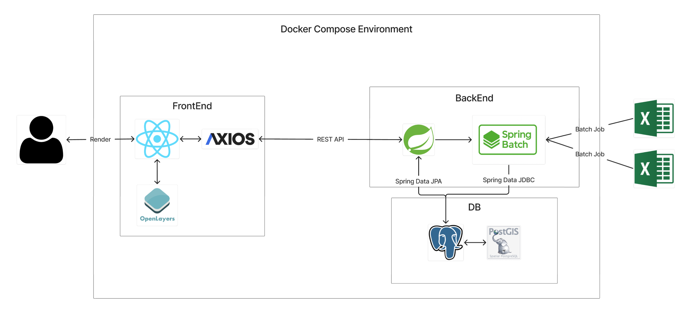

# 측정값 관리 시스템
> 엑셀 기반 초기 데이터 적재, 위치/측정값 관리, PostGIS 반경 조회, OpenLayers 지도 시각화를 구현한 풀스택 웹 애플리케이션

---

## 1. 프로젝트 개요

본 프로젝트는 제공된 `측정위치.xlsx`, `측정값.xlsx` 파일을 기반으로 초기 데이터를 적재하고,  
위치 생성 / 측정값 등록 / 반경 3km 조회 기능을 제공하는 측정값 관리 시스템입니다.

핵심 요구사항은 다음과 같습니다.

- 엑셀 기반 초기 데이터 구축
- 주소/좌표 변환을 통한 결측 데이터 보정
- `geometry(Point, 4326)` 컬럼 생성 및 공간 쿼리 수행
- 위치 생성 API
- 측정값 등록 API 및 부모 위치의 `light_source_count` 갱신
- 특정 지점 기준 반경 3km 이내 데이터 조회
- GeoJSON 기반 지도 시각화

---
## 2. 핵심 기능
### 2.1 초기 데이터 적재
- `측정위치.xlsx`와 `측정값.xlsx`를 읽어 DB에 적재
- 위치 데이터 적재 시 주소/좌표 결측 여부를 판별
- 주소만 있으면 Geocoding으로 좌표 생성
- 좌표만 있으면 Reverse Geocoding으로 주소 생성
- 최종적으로 `geometry(Point, 4326)` 컬럼을 생성하여 공간 조회에 활용

### 2.2 위치 생성
- 사용자가 주소 또는 좌표를 입력해 신규 위치를 등록
- 주소 입력 시 좌표를 생성하고
- 좌표 입력 시 주소를 생성해 저장
- 저장 완료 후 위치 식별자와 기본 정보를 반환

### 2.3 측정값 등록
- 특정 위치(`location_system_id`)에 측정값을 등록
- 등록 완료 후 부모 위치의 `light_source_count`를 함께 갱신

### 2.4 반경 3km 조회
- 사용자가 입력한 주소 또는 좌표를 기준 중심점으로 변환
- PostGIS 공간 쿼리로 반경 3km 이내 위치를 조회
- 조회 결과를 GeoJSON `FeatureCollection` 형태로 반환
- 프론트엔드에서 마커 및 반경 영역으로 시각화

---

## 3. 기술 스택
### Backend
- Java 17
- Spring Boot 3.4.11
- Spring Data JPA
- Spring Data JDBC
- Spring Batch
- PostgreSQL + PostGIS

### Frontend
- React 19.2
- Axios
- OpenLayers
- OpenStreetMap

### Data / Infra
- Apache POI / spring-batch-excel
- Docker / Docker Compose

### External API
- Google Geocoding API

---
## 4. 패키지 구조
```text
project
├─ backend
│  ├─ batch
│  │  ├─ config
│  │  ├─ dto
│  │  ├─ processor
│  │  ├─ reader
│  │  ├─ tasklet
│  │  └─ writer
│  ├─ common
│  │  ├─ config
│  │  ├─ error
│  │  ├─ geojson
│  │  └─ util
│  ├─ location
│  │  ├─ controller
│  │  ├─ dto
│  │  ├─ entity
│  │  ├─ repository
│  │  └─ service
│  └─ measurement
│     ├─ controller
│     ├─ dto
│     ├─ entity
│     ├─ repository
│     └─ service
└─ frontend
   ├─ api
   ├─ components
   ├─ styles
   └─ utils
```

---

## 5. 시스템 구조도


---

## 6. 실행 방법
### 6.1 사전 준비
- Java 17 이상
- Node.js 18 이상
- Docker / Docker Compose
- PostgreSQL(PostGIS)
- Google Geocoding API Key

### 6.2 환경 변수
백엔드 실행 전 외부 API Key와 DB 접속 정보를 설정합니다.

```env
GOOGLE_GEOCODING_API_KEY=YOUR_API_KEY
SPRING_DATASOURCE_URL=jdbc:postgresql://localhost:5432/sph
SPRING_DATASOURCE_USERNAME=postgres
SPRING_DATASOURCE_PASSWORD=postgres
```

### 6.3 Docker Compose 실행
```bash
docker compose up --build
```

### 6.4 수동 실행(선택)
- DB
```bash
docker compose up -d db
```

- BackEnd
```bash
cd backend
./gradlew bootRun
```

- FrontEnd
```bash
cd frontend
npm install
npm run dev
```

---